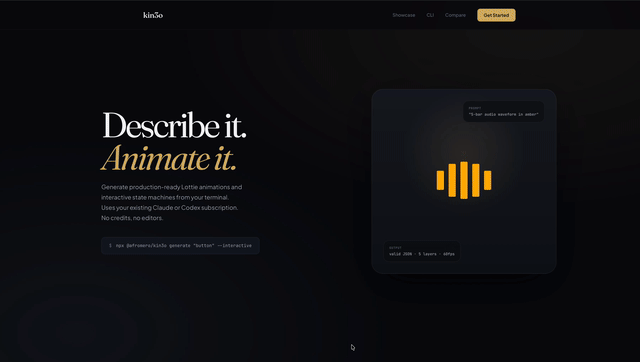

<div align="center">

# kin3o

**Text to Motion. From your terminal.**

[](https://www.npmjs.com/package/@afromero/kin3o)
[](https://github.com/affromero/kin3o/actions/workflows/ci.yml)
[](https://www.typescriptlang.org/)
[](https://opensource.org/licenses/MIT)
[](https://github.com/affromero/kin3o/pulls)

AI-powered Lottie animation generator. Turns natural language prompts into valid, playable Lottie JSON and interactive dotLottie state machines using your existing Claude or Codex subscription.



</div>

## Why?

Great tools like [LottieFiles](https://lottiefiles.com), [Lottielab](https://www.lottielab.com), and [Rive](https://rive.app) offer powerful visual editors, massive animation libraries, and team collaboration — if you need a full design workflow, they're excellent choices.

kin3o takes a different approach: it's a CLI tool for developers who want to generate animations from their terminal using AI subscriptions they already pay for. Search and download from the [LottieFiles](https://lottiefiles.com) marketplace (122K+ community animations), refine with AI, and publish back — all without leaving the terminal.

## Choosing the right tool

There are great tools for different animation workflows. Here's an honest look at where each shines:

| Tool | Best for | Strengths |
|------|----------|-----------|
| **kin3o** | Developers who want animations from their terminal | CLI-first, uses your existing AI subscription, open source, git-friendly JSON output, interactive state machines from text |
| [**Rive**](https://rive.app) | Complex interactive animations with a visual editor | Skeletal animation, mesh deformation, runtime inputs (cursor tracking, sliders), built-in state machines, beautiful visual editor |
| [**LottieFiles**](https://lottiefiles.com) | Finding and sharing animations | Massive community library, Motion Copilot AI, After Effects integration, team collaboration — kin3o integrates directly for search, download, and publish |
| [**Lottielab**](https://www.lottielab.com) | Designing Lottie animations visually | Polished editor with timeline and keyframes, team collaboration, export to Lottie JSON |
| [**Recraft**](https://www.recraft.ai) | AI-powered design with animation export | Visual AI design tool, vector and animation output, broad creative capabilities |

## Quick Start

```bash
# Install globally
npm install -g @afromero/kin3o

# Generate a static animation
kin3o generate "loading spinner with 3 dots"

# Generate an interactive state machine
kin3o generate "toggle switch with on/off states" --interactive
```

Or use without installing:

```bash
npx @afromero/kin3o generate "pulsing circle"
```

## CLI Usage

```bash
# Static animations (.json)
kin3o generate "pulsing circle that breathes"
kin3o generate "5-bar audio waveform" --provider claude-code --model sonnet
kin3o generate "notification bell" --no-preview --output bell.json
kin3o generate "loading dots" --tokens sotto

# Interactive state machines (.lottie)
kin3o generate "toggle switch with on/off states" --interactive
kin3o generate "like button with hover and click" --interactive

# Refine an existing animation
kin3o refine output/animation.json "make it faster and add easing"
kin3o refine output/animation.lottie "add a bounce on the pressed state"

# Preview
kin3o preview output/animation.json
kin3o preview output/animation.lottie

# Validate
kin3o validate output/animation.json
kin3o validate output/animation.lottie

# List available AI providers
kin3o providers

# Marketplace (LottieFiles)
kin3o search "loading spinner"                         # Search marketplace
kin3o search --featured --limit 10                     # Browse featured
kin3o search --popular                                 # Browse popular
kin3o search "button" --no-browser                     # Terminal output only
kin3o download abc12345                                # Download by UUID
kin3o download <url> --lottie                          # Download as .lottie
kin3o login                                            # Authenticate for publishing
kin3o publish output/anim.json --name "My Anim" --tags "loading,ui"
kin3o logout                                           # Clear auth token

# Export to video
kin3o export output/animation.json                     # MP4 (default: 1080p 30fps)
kin3o export output/animation.json --format gif        # GIF
kin3o export output/animation.json --format webm       # WebM (supports transparency)
kin3o export output/animation.lottie --res 720p        # dotLottie → MP4 at 720p
kin3o export output/animation.json --bg white -o out.mp4  # Custom background + path

# Live preview with hot reload
kin3o view output/animation.json                       # File watcher + auto-reload
kin3o view output/animation.lottie --port 3000         # Specific port
```

### Options

| Flag | Description |
|------|-------------|
| `-p, --provider <name>` | AI provider (`claude-code`, `codex`, `anthropic`) |
| `-m, --model <name>` | Model (`sonnet`, `opus`, `haiku`, `codex`) |
| `-o, --output <path>` | Output filename |
| `--no-preview` | Skip browser preview |
| `-i, --interactive` | Generate interactive state machine (`.lottie` output) |
| `-t, --tokens <path>` | Design tokens JSON or `sotto` preset |
| `--featured` | Browse featured marketplace animations |
| `--popular` | Browse popular marketplace animations |
| `--recent` | Browse recent marketplace animations |
| `--limit <n>` | Number of search results (default: 20) |
| `--no-browser` | Print search results in terminal |
| `--lottie` | Download `.lottie` format instead of `.json` |
| `--port <n>` | Port for view server (auto-selects if omitted) |
| `--format <fmt>` | Export format: `mp4`, `webm`, `gif` (default: `mp4`) |
| `--res <res>` | Export resolution: `1080p`, `720p`, `480p`, `4k`, or `WxH` |
| `--fps <n>` | Export frames per second (default: `30`) |
| `--bg <color>` | Export background color (hex or name) |

## Using Generated Animations

### Static animations (`.json`)

```tsx
// React (lottie-react)
import Lottie from 'lottie-react';
import animationData from './pulsing-circle.json';

<Lottie animationData={animationData} loop autoplay />
```

```html
<!-- Vanilla JS (lottie-web) -->
<script src="https://cdnjs.cloudflare.com/ajax/libs/lottie-web/5.12.2/lottie.min.js"></script>
<div id="anim"></div>
<script>
  lottie.loadAnimation({
    container: document.getElementById('anim'),
    path: './pulsing-circle.json',
    loop: true,
    autoplay: true,
  });
</script>
```

```swift
// iOS (lottie-ios)
let animationView = LottieAnimationView(name: "pulsing-circle")
animationView.loopMode = .loop
animationView.play()
```

### Interactive state machines (`.lottie`)

```html
<!-- dotlottie-web — hover, click, and tap state transitions -->
<script type="module">
  import { DotLottie } from 'https://esm.sh/@lottiefiles/dotlottie-web';
  const dotLottie = new DotLottie({
    canvas: document.querySelector('canvas'),
    src: './toggle-switch.lottie',
    autoplay: true,
  });
</script>
```

## Why Lottie?

kin3o generates [Lottie](https://airbnb.io/lottie/) because its JSON format is ideal for AI generation — structured, text-based, and diffable. [Rive](https://rive.app) is a fantastic tool with capabilities Lottie doesn't have (skeletal animation, mesh deformation, runtime inputs), but its binary `.riv` format can't be generated by LLMs today.

| What you need | Best tool |
|--------------|-----------|
| AI-generated animations from text | **kin3o** (Lottie JSON) |
| Interactive state machines from text | **kin3o** (dotLottie) |
| Skeletal animation, mesh deformation | [Rive](https://rive.app) (visual editor) |
| Massive animation library + community | [LottieFiles](https://lottiefiles.com) |
| Polished visual animation editor | [Lottielab](https://www.lottielab.com) or [Rive](https://rive.app) |
| Runtime inputs (cursor tracking, sliders) | [Rive](https://rive.app) |
| Search, download, publish to marketplace | **kin3o** + [LottieFiles](https://lottiefiles.com) |

Lottie covers shapes, paths, easing, color transitions, masking, and — via dotLottie — interactive state machines (hover, click, tap). That handles the vast majority of UI animations, loading states, and micro-interactions.

## Architecture

```
Static:      prompt → generate() → extractJson() → validateLottie() → autoFix() → .json → preview
Interactive: prompt → generate() → extractInteractiveJson() → validate animations + state machine → .lottie → preview
Export:      .json/.lottie → headless Chrome (lottie-web) → frame capture → FFmpeg → MP4/WebM/GIF
Marketplace: search → browse → download → validate → .json/.lottie → refine → publish
Live preview: view <file> → HTTP server + fs.watch → SSE → browser auto-reload
```

### Prompt System

All prompts live in `src/prompts/` with a barrel export at `src/prompts/index.ts`:

| Module | Purpose |
|--------|---------|
| `system.ts` | Static Lottie generation prompt + `LOTTIE_FORMAT_REFERENCE` |
| `system-interactive.ts` | Interactive state machine prompt (imports shared ref) |
| `examples.ts` | Few-shot: pulsing circle, waveform bars |
| `examples-interactive.ts` | Few-shot: interactive button (idle/hover/pressed) |
| `examples-mascot.ts` | kin3o mascot/logo (static + interactive) |
| `tokens.ts` | Design token loader (hex → Lottie RGBA) |

## Prerequisites for Export

The `export` command requires Chrome/Chromium and FFmpeg installed on your system:

```bash
# macOS
brew install --cask google-chrome
brew install ffmpeg

# Linux
sudo apt install chromium-browser ffmpeg
```

Or set `CHROME_PATH` and `FFMPEG_PATH` environment variables to custom paths.

## Development

```bash
npm install
npm run typecheck    # Type check
npm run test         # Run tests (node --test)
npm run ci           # typecheck + test
npm run build        # Compile to dist/
```

## License

MIT
